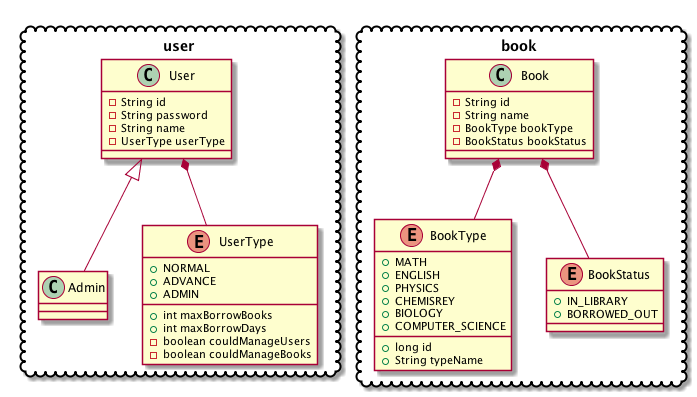
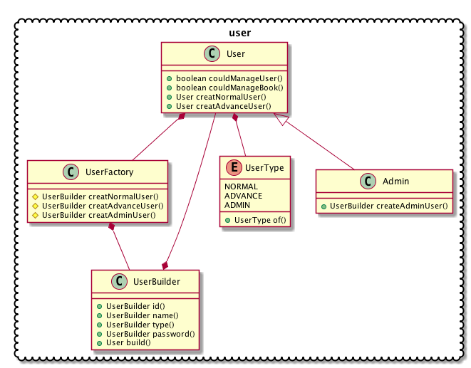
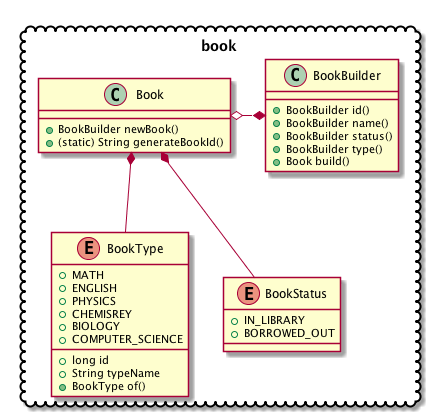
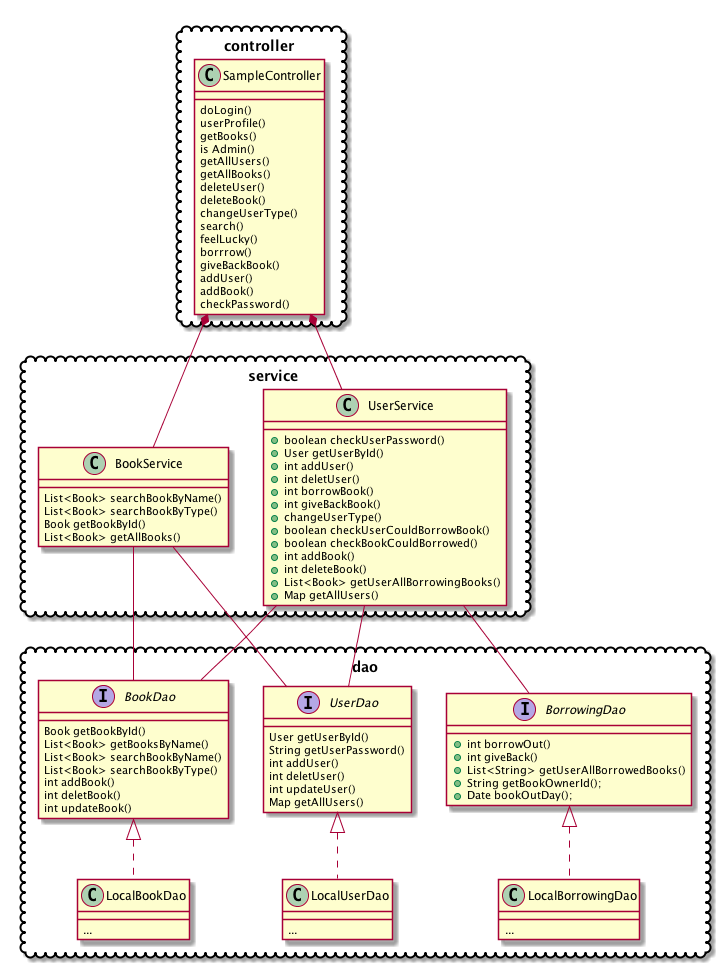

# 面向对象分析与设计项目文档

## 选题及成员

选题：图书管理系统

| 学号 | 姓名 | 分工 |
| -------- | ---- | ---- |
| ... | ... | ...  |

## 目录

[TOC]

## 需求分析

## 用例分析

## 实体类类图



## 设计模式


在User类及其子类Admin中, 使用了抽象工厂的设计模式
```
public class User{
    
    protected String id;
    
    protected String name;
    
    protected transient String password;
    
    protected UserType userType;
    
    protected final static UserFactory factory = new UserFactory();
    
    public static UserBuilder createNormalUserBuilder(){
        return factory.createNormalUser();
    }
    
    public static UserBuilder createAdvanceUserBuilder(){
        return factory.createAdvanceUser();
    }
   
}

public class Admin extends User{
    
    protected UserType userType = UserType.ADMIN;
    
    public UserBuilder createAdminUserBuilder(){
        return factory.createAdminUser();
    }
    
}

```

在这里使用抽象工厂方法主要是为了屏蔽UserBuilder类的userType(UserType type)方法.
这样做可以屏蔽掉普通用户想要创建Admin用户的风险.

```
public class UserBuilder{
    
    User user;
    
    UserBuilder(){
        user = new User();
    }
    
    public UserBuilder id(String o){
        user.setId(o);
        return this;
    }
    
    public UserBuilder name(String name){
        user.setName(name);
        return this;
    }
    
    public UserBuilder password(String password){
        user.setPassword(password);
        return this;
    }
    
    UserBuilder type(UserType userType){
        user.setUserType(userType);
        return this;
    }
    
    
    public User build(){
        return this.user;
    }
    
}

```

## 顺序图

## 完整类图


### user 类图


### book 类图


### book 类图


## 项目实现

## 测试

## 可扩展性分析
