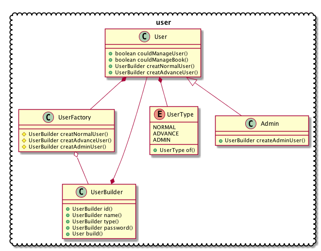

# 面向对象分析与设计项目文档

## 选题及成员

选题：图书管理系统

| 学号 | 姓名 | 分工 |
| -------- | ---- | ---- |
| ... | ... | ...  |

## 目录

[TOC]

## 需求分析

## 用例分析

### 用例图


### 用例分析文档


## 实体类类图

### 名词分析法


### 仅带有属性的实体类类图


## 设计模式


在User类及其子类Admin中, 使用了抽象工厂的设计模式
```Java
@Data
public class User{
    
    protected String id;
    
    protected String name;
    
    protected transient String password;
    
    protected UserType userType;
    
    protected final static UserFactory factory = new UserFactory();
    
    public static UserBuilder createNormalUserBuilder(){
        return factory.createNormalUser();
    }
    
    public static UserBuilder createAdvanceUserBuilder(){
        return factory.createAdvanceUser();
    }
    
    ...
}
```

在这里使用抽象工厂方法主要是为了屏蔽UserBuilder类的userType(UserType type)方法.
这样做可以屏蔽掉普通用户想要创建Admin用户的风险.

```Java
public class UserBuilder{
    
    User user;
    
    UserBuilder(){
        user = new User();
    }
    
    public UserBuilder id(String o){
        user.setId(o);
        return this;
    }
    
    public UserBuilder name(String name){
        user.setName(name);
        return this;
    }
    
    public UserBuilder password(String password){
        user.setPassword(password);
        return this;
    }
    
    UserBuilder type(UserType userType){
        user.setUserType(userType);
        return this;
    }
    
    public User build(){
        return this.user;
    }
    
}
```

## 顺序图

## 完整类图


### user 类图


### book 类图


### book 类图


## 项目实现

详见 [github项目地址](https://github.com/Shynoo/oo-project-server/tree/frontend)


## 测试

### 借书测试及活动图

```Java
@Test
public void borrowBookTest(){
    userService.borrowBook("1","CS121");
    Book book=bookService.getBookById("CS121");
    List ls=userService.getUserAllBorrowingBooks("1");
    Assert.assertTrue(ls.contains(book));
    Assert.assertTrue(book.getBookStatus().equals(BookStatus.IN_LIBIRARY));
}
```


### 用户登录测试及活动图

```Java
@Test
public void userLogInTest(){
    String id = "1";
    String password = "123";
    Result r = sampleConreoller.doLogin(id, password);
    User u = (User) r.get();
    Assert.assertEquals(u, userService.getUserById(id));
    Assert.assertTrue(userService.isOnline(u);
}
```


## 可扩展性分析


### 加入修改图书信息的功能
功能描述: 管理员可以修改图书的信息, 如图书name, type等.

### 解决方案
1. 页面提供一个功能的入口, 让用户提交图书id和图书的新信息. 
2. controller收到信息后调用userService检查用户是否有修改图书信息的权限.
3. controller调用bookService的updateBookInfo(Book book)方法.
4. bookService调用bookDao的updateBook(Book book)方法
5. 修改图书信息成功 